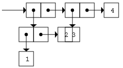

# scheme.js

编程语言[Scheme](https://en.wikipedia.org/wiki/Scheme_(programming_language))的JavaScript实现。  
IDE: [https://hlpp.github.io/scheme.js/ide/](https://hlpp.github.io/scheme.js/ide)


## 特性
目前的支持:
* 变量引用: `<variable>`
* 局部变量: `let`
* 常量引用: `quote`,`'`  
* 过程调用: `(operator operand ...)`
* 过程: `lambda`  
  + 支持固定数量参数, 任意数量参数和n个或更多不定数量参数  
  + 抄录了JavaScript语言中的隐含参数`arguments`和`callee`
* 静态(词法)作用域
* 闭包
* 动态类型
* 第一级函数
* 传值调用
* 定义: `define`
* 赋值: `set!`
* 顺序结构: `begin`
* 条件表达式: `if`,`cond`,`case`,`when`,`unless`,`and`,`or`
* 递归
* 尾递归
* 迭代结构: `let`,`do`,`while`,`for`
* 标准过程
    + 相等谓词  
        `eqv?`,`eq?`,`equal?`
    + 数值运算和数值输入/输出  
        `number?`,`=`,`<`,`<`,`>`,`<=`,`>=`,`+`,`*`,`-`,`/`,
        `zero?`,`positive?`,`negative?`,`odd?`,`even?`,`abs`,`remainder`,  
        `number->string`,`string->number`
       1. 整数: `integer?`
       2. 实数: `real?`
    + 其它数据类型  
       1. 布尔  
        `boolean?`,`not`
       2. 序对和表  
        `pair?`,`cons`,`car`,`cdr`,`set-car!`,`set-cdr!`,  
        `caar`,`cadr` `...` `cdddar`,`cddddr` (`car`和`cdr`的组合,定义到第四层),  
        `null?`,`list?`,`list`,`length`,`append`,`reverse`,`list-tail`,`list-ref`,`memq`,`memv`
       3. 符号  
        `symbol?`,`symbol->string`,`string->symbol`,`symbol->string-ci`
       4. 字符  
        `char?`,`char=?`,`char-upper-case?`,`char-lower-case?`,`char-upcase`,`char-downcase`
       5. 字符串  
        `string?`,`make-string`,`string`,`string-length`,`string-ref`,`string-set!`,  
        `string=?`,`string-ci=?`,`substring`,`string-append`,`string->list`,`list->string`,  
        `string-copy`,`string-fill!`
    + 控制特征  
        `procedure?`,`apply`,`map`,`for-each`,`void`,`void?`
    + 求值  
        `eval`,`interaction-environment`,`expand`
    + 输入/输出  
        `read`,`write`,`newline`,`display`,`error`
 
* 注释  
  单行注释：`;line comment`
### 扩展与库
* 盒子-指针表示:`draw-box-pointer`  
  过程`draw-box-pointer`可以画出序对的盒子指针表示方式，帮你理解序对的更形象的方式。  
  ```scheme
  (draw-box-pointer (cons 1 2))
  (draw-box-pointer (cons
                      (cons 1 2)
                      (cons 3 4)))
  (draw-box-pointer (cons (cons 1
                                (cons 2 3))
                          4))
   ```
  
  
  
* `ajax-load`
  ```scheme
  (ajax-load "tests/xyz.scm" (lambda () (alert 'onload)))
  ```
* 基础语言JavaScript的能力


## 嵌入到HTML的方法
 1. 将Scheme代码放在`script`标签中，该标签具有两个属性: `type="text/scm"`和`ignore`。  
  `type`属性是必须的，其值`"text/scm"`是我们自定义的，它表示内容是Scheme而非JavaScript代码；  
  `ignore`属性是可选的，如果存在该属性，则其标签中的Scheme代码不会被自动执行。  
  下面是例子：
    ```html
    <script type="text/scm">
    (alert "hello scheme")
    </script>
    <script type="text/scm">
    (define gn 3)
    </script>
    <script type="text/scm" ignore>
    (set! gn (+ gn 1)
    </script>
    <script type="text/scm">
    (set! gn (+ gn 1)
    </script>
    <script type="text/scm">
    (alert gn)
    
    (define (factorial n)
      (if (< n 2)
          n
          (* n (callee (- n 1)))))
    (define n (prompt "input n"))
    (alert (string-append "!" n (string #\=)
      (number->string (factorial (string->number n)))))
    </script>
    ```

 2. 在所有scheme代码之后，引入broswer-loader.js和scm.js：
    ```html
    <script src="../src/browser-loader.js"></script>
    <script src="../src/scm.js"></script>
    ```

 3. 上面的例子程序运行会弹出 hello scheme 和 4 。

## 更多
- [代码结构说明](docs/code_struct.md)

   